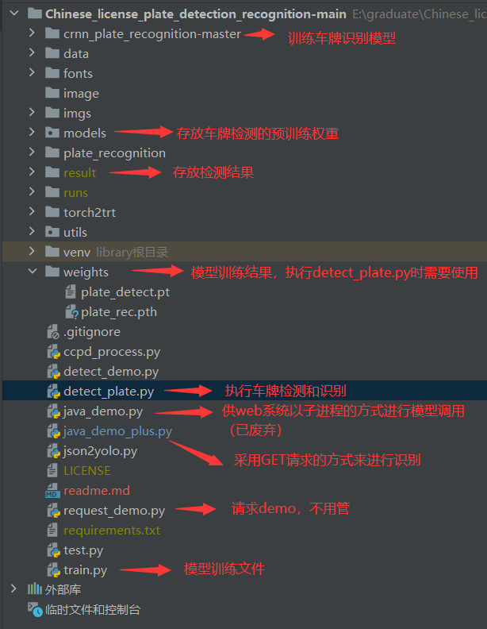
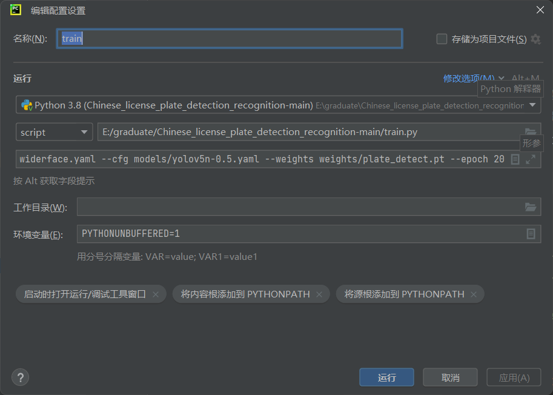
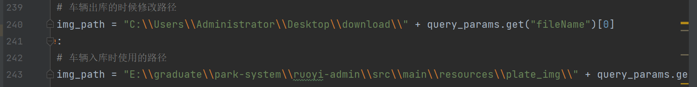

## **车牌检测和识别模型**

声明：本模型均来自于大佬的 github 项目，具体项目请移步到 Reference ，如果侵权请联系本人删除，在这里特别感谢大佬的模型，大佬的 github 主页是[https://github.com/we0091234]

本项目是我毕设的一部分，也欢迎大家去我的停车场管理系统项目点一个小小的start,，谢谢各位！[https://github.com/improveyour/park-system]


**环境要求: python >=3.6  pytorch >=1.7**

**快速启动**：

1.安装好需要导入的包

2.直接运行detect_plate.py 或者运行如下命令行：

```
python detect_plate.py --detect_model weights/plate_detect.pt  --rec_model weights/plate_rec.pth --image_path imgs --output result
```

测试文件夹imgs，结果保存再 result 文件夹中

**项目结构说明**：





## **车牌检测训练**

**1.下载数据集：**  数据集可以联系QQ获取：1677830702
数据从CCPD和CRPD数据集中选取并转换的
   数据集格式为yolo格式：

```
   label x y w h  pt1x pt1y pt2x pt2y pt3x pt3y pt4x pt4y
```

   关键点依次是（左上，右上，右下，左下）
   坐标都是经过归一化，x,y是中心点除以图片宽高，w,h是框的宽高除以图片宽高，ptx，pty是关键点坐标除以宽高

   **自己的数据集**可以通过lablme 软件,create polygons标注车牌四个点即可，然后通过json2yolo.py 将数据集转为yolo格式，即可训练

**2.修改 data/widerface.yaml    train和val路径,换成你的数据路径**

```
train: /your/train/path #修改成你的训练集路径
val: /your/val/path     #修改成你的验证集路径
# number of classes
nc: 2                 #这里用的是2分类，0 单层车牌 1 双层车牌

# class names
names: [ 'single','double']

```

**3.在 cmd 或者在 Pycharm 中使用如下命令训练模型，也可以通过配置 train.py 的运行配置，如下图**

```
python3 train.py --data data/widerface.yaml --cfg models/yolov5n-0.5.yaml --weights weights/plate_detect.pt --epoch 120
```



结果存在run文件夹中


## **车牌识别训练**

**1.从CCPD和CRPD截下来的车牌小图以及别人收集的一部分车牌 有需要的话加qq获取:1677830702**

**2.数据集打上标签,生成train.txt和val.txt**


图片命名如上图：**车牌号_序号.jpg**
然后执行如下命令，得到train.txt和val.txt

```
python plateLabel.py --image_path your/train/img/path/ --label_file datasets/train.txt
python plateLabel.py --image_path your/val/img/path/ --label_file datasets/val.txt
```

数据格式如下：

train.txt

```
/mnt/Gu/trainData/plate/new_git_train/CCPD_CRPD_ALL/冀BAJ731_3.jpg 5 53 52 60 49 45 43 
/mnt/Gu/trainData/plate/new_git_train/CCPD_CRPD_ALL/冀BD387U_2454.jpg 5 53 55 45 50 49 70 
/mnt/Gu/trainData/plate/new_git_train/CCPD_CRPD_ALL/冀BG150C_3.jpg 5 53 58 43 47 42 54 
/mnt/Gu/trainData/plate/new_git_train/CCPD_CRPD_OTHER_ALL/皖A656V3_8090.jpg 13 52 48 47 48 71 45 
/mnt/Gu/trainData/plate/new_git_train/CCPD_CRPD_OTHER_ALL/皖C91546_7979.jpg 13 54 51 43 47 46 48 
/mnt/Gu/trainData/plate/new_git_train/CCPD_CRPD_OTHER_ALL/皖G88950_1540.jpg 13 58 50 50 51 47 42 
/mnt/Gu/trainData/plate/new_git_train/CCPD_CRPD_OTHER_ALL/皖GX9Y56_2113.jpg 13 58 73 51 74 47 48 
```

**3.将 train.txt  和 val.txt 路径写入lib/config/360CC_config.yaml 中**

```
DATASET:
  DATASET: 360CC
  ROOT: ""
  CHAR_FILE: 'lib/dataset/txt/plate2.txt'
  JSON_FILE: {'train': 'datasets/train.txt', 'val': 'datasets/val.txt'}
```

**4.执行如下命令开始训练模型**

```
python train.py --cfg lib/config/360CC_config.yaml
```

结果保存再output文件夹中

**5.测试识别模型**

```
python demo.py --model_path saved_model/best.pth --image_path images/test.jpg
                                   or your/model/path
```

## References

- [https://github.com/we0091234/Chinese_license_plate_detection_recognition]
- [https://github.com/we0091234/crnn_plate_recognition]

## 注意事项

在 java_demo_plus.py  中由于毕设项目的需要，使用了部分绝对路径，如需要执行该文件，需要替换里面的绝对路径为自己的路径



